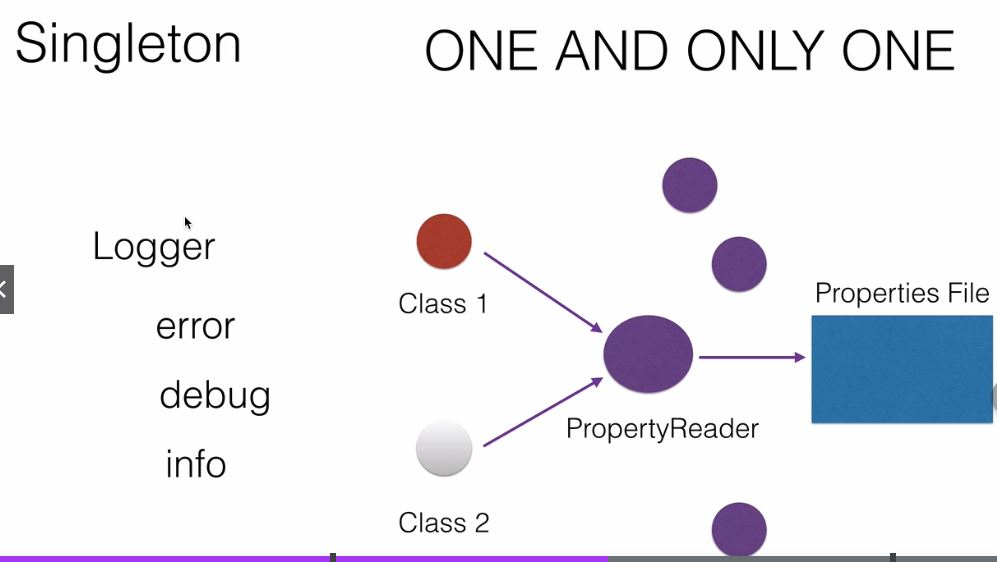
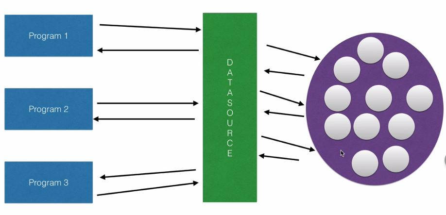

## Singleton

In this lecture you will learn what a singleton pattern is and why we needed. A singleton pattern, is a object creational pattern that allows our application to create one and only one instance of a particular class no matter how many times that class is used in our application.

`Use case`

 

Property reader class - that can read the properties from a file and it is
used multiple times in our application by different classes. But we are going to create only one object of the property reader and not multiple saving a lot of memory using the singleton pattern. So all applications application classes will use the same property reader object to perform the property reading from a file.

Logger class - using logger's we can log different types of information
errors debugging information and just general information from our application to a log file so that developers can read that log file later on to see what is happening with our application. So a logger can be a singleton the same logger object can be shared across our application classes.

  

Data source class - good example in the JDBC world, the data source class in the JDBC API the data source class is responsible for maintaining a connection pool and giving a connection from the pool to our application classes. We can have different classes in the application that need a database connection but there will be only one instance of the data source. So a data source is also an example of singleton.

To summarize a singleton pattern using a singleton pattern when we implement a singleton pattern in our application for a particular class only one instance of that class can be created and that will be shared across all the other application classes as required.

## Steps

1. decalre contructor of the class as private
2. declare a static method
3. declare a static member of the same class type in the class